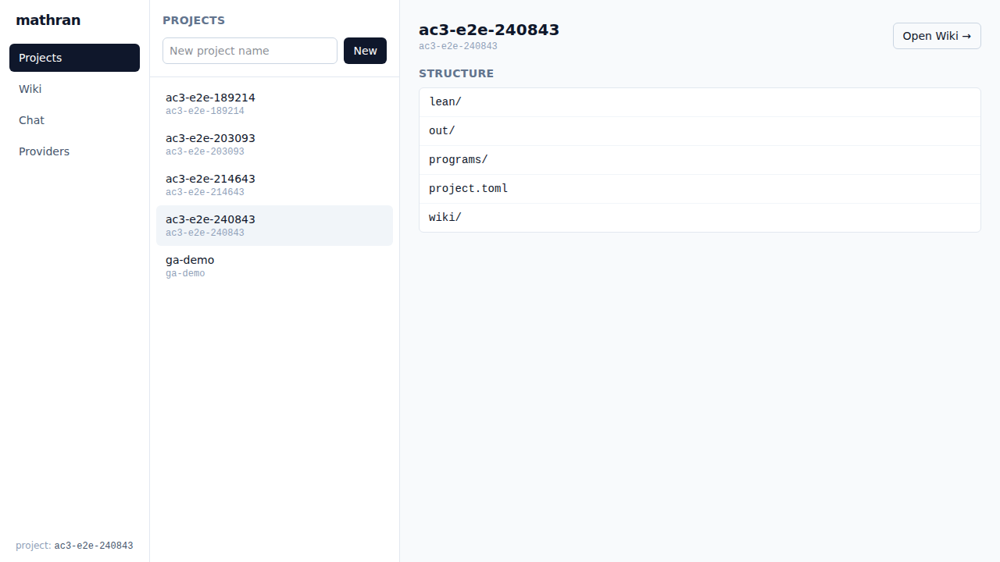
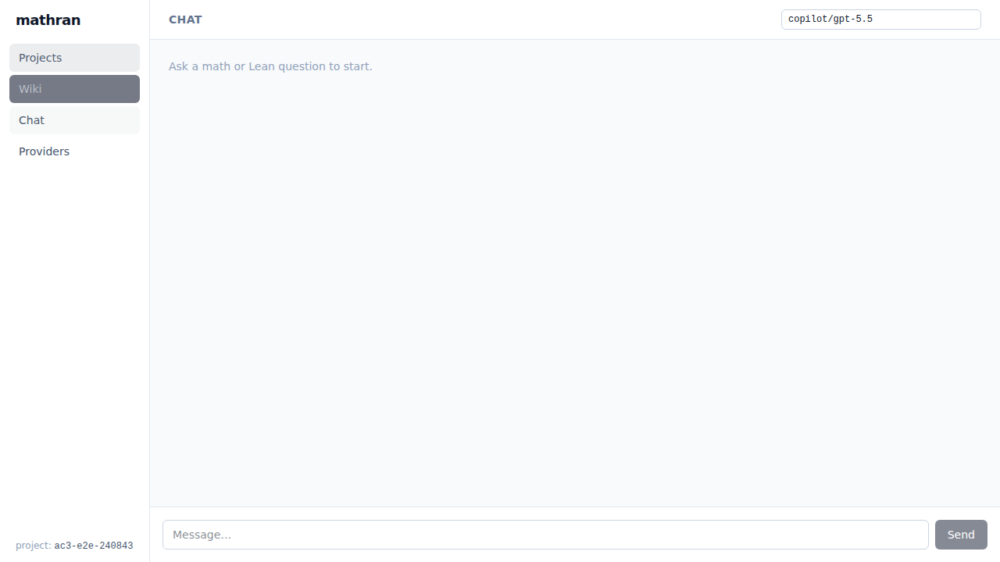

# mathran

> Standalone agent runtime for mathematical reasoning + Lean theorem proving.

Mathran is a local-first mathematician's workstation: a conversational CLI plus
a tiny self-hosted Web UI that drives LLMs through a Lean 4 toolchain. Bring
your own LLM key (Azure OpenAI / OpenAI / Anthropic / GitHub Copilot / Ollama),
your own `elan` toolchain, and your own filesystem — no database required.

It is extracted from the [Mathub](https://github.com/subfish-zhou/Mathub)
research platform as a reusable building block.

> **Status: v0.1.0-rc.1** — release-candidate cut. Conversational CLI,
> multi-provider model router, file-system project workspace, local web UI
> (Hono + React/Vite SPA), and a real Lean check tool are all wired up. See
> the [Status](#status) table at the bottom.

## 5-minute quick start

```bash
# 1. Install (once published)
npm install -g mathran

# 2. Check your environment
mathran doctor

# 3. Configure at least one LLM provider — pick one:
#    a) GitHub Copilot session (uses ~/.config/github-copilot/token.json)
export COPILOT_TOKEN=...                       # optional, otherwise uses session

#    b) Azure OpenAI
export AZURE_OPENAI_API_KEY=...
export AZURE_OPENAI_ENDPOINT=https://YOUR-RESOURCE.openai.azure.com
#    c) OpenAI
export OPENAI_API_KEY=...
#    d) Anthropic
export ANTHROPIC_API_KEY=...

# 4. Optional: declare provider routing in ~/mathran-workspace/config.toml
mkdir -p ~/mathran-workspace
cat > ~/mathran-workspace/config.toml <<'EOF'
defaultModel = "copilot/gpt-5.5"

[providers.copilot]
kind = "copilot"
defaultModel = "gpt-5.5"
# Optional whitelist: when set, only these bare model names are accepted
# (typo-guard). Omit it to allow any model the provider supports.
allowedModels = ["gpt-5.5", "claude-opus-4.8"]
EOF

# Pick a model per run with `provider/model` syntax:
#   mathran chat --model copilot/claude-opus-4.8
# Sub-agents can also be dispatched with a per-run model override; the main
# agent decides (e.g. Opus for Lean/math, GPT for research). See /agents.

# 5. Create a project + ask the agent something
mathran project init my-proof
mathran -p "Use lean_check to verify: theorem t : 1+1=2 := by rfl"

# 6. Open the web workstation in your browser
mathran serve
# → http://127.0.0.1:7878
```

## What you get

### Conversational CLI

```
$ mathran -p "verify theorem foo : 1+1=2 := by rfl"
· calling lean_check({"leanSource":"theorem foo : 1+1=2 := by rfl"})
· lean_check → ok
  lean_check: OK (compiled cleanly in 388ms)
OK
```

The `mathran` REPL shares the same conversation kernel as the web Chat panel —
identical model, identical tools (`lean_check` + future Sage/Python).

### Local Web Workstation (`mathran serve`)

A four-panel SPA at `http://127.0.0.1:7878`:

- **Projects** — list and create projects on the filesystem
- **Wiki** — read/write Markdown wiki pages per project
- **Chat** — the same conversational agent, in the browser, with streaming
- **Providers** — see configured providers and the active default model




All artifacts land in `~/mathran-workspace/projects/<slug>/` (no database).
The server only ever binds to `127.0.0.1`.

### Filesystem project layout

```
~/mathran-workspace/
├── config.toml                 # provider routing
└── projects/
    └── my-proof/
        ├── project.toml        # project metadata
        ├── wiki/
        │   └── index.md        # auto-generated by `project init`
        ├── lean/               # your .lean files
        ├── programs/           # agent scratchpads
        └── out/                # agent artifacts (markdown + commits)
```

Every wiki write commits via local `git`, so your project doubles as a
reviewable changelog.

## Prerequisites

- Node ≥ 20
- A Lean 4 toolchain installed via `elan` (`elan`, `lake`, `lean` on PATH)
- At least one LLM provider key (or an active GitHub Copilot session)

## CLI

```
mathran                          Start the conversational REPL
mathran -p "<prompt>"            One-shot prompt
mathran -p "..." -m azure/gpt-5  Override the model for this turn
mathran project init <name>      Scaffold a new project
mathran serve                    Local web workstation (Hono + SPA)
mathran doctor                   Environment health check
mathran --version                Print version
mathran --help                   Show help
```

## Architecture

mathran ships **four pluggable provider interfaces** under `src/core/providers/`:

- **LeanProvider** — shells out to local `elan`/`lake`/`lean`
- **LLMProvider** — multi-backend router (Azure / OpenAI / Anthropic / Copilot / Ollama)
- **Storage** — agent run state, scratchpad, memory (filesystem by default)
- **ArtifactSink** — writes markdown / lean / logs into project directories

The agent loop (`src/lib/agent/`) is platform-agnostic and consumes these
interfaces. You can swap any provider via env variables, `config.toml`, or
programmatic configuration.

## Status

| Phase                                  | Status |
|----------------------------------------|--------|
| A — Skeleton from Mathub               | ✓      |
| B — Provider interfaces                | ✓      |
| C — CLI scaffolding                    | ✓      |
| D — Type system passes                 | ✓      |
| D2 — Real provider impls + Web UI      | ✓      |
| E — npm publish                        | ⏳     |

`npm publish` runs `npm run build:all` automatically (see `prepublishOnly`),
so the SPA bundle is always shipped with the tarball.

See `PRD.md` for the full v0.1.0 GA acceptance matrix (AC1–AC11) and
[`_tasks/v0.1.0-ga-finish/REPORT.md`](_tasks/v0.1.0-ga-finish/REPORT.md) for the
acceptance run results.

## License

MIT © subfish-zhou

## Acknowledgements

This codebase is extracted from [Mathub](https://github.com/subfish-zhou/Mathub),
a research platform for AI-assisted mathematics being built at MSRA.
